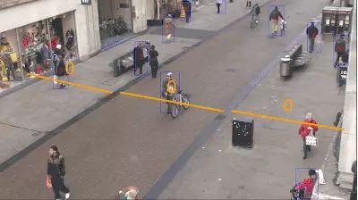
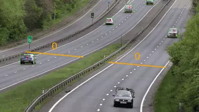
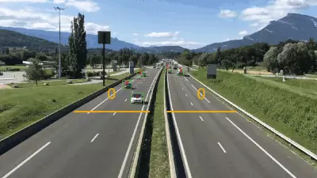
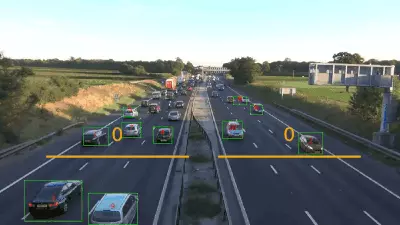
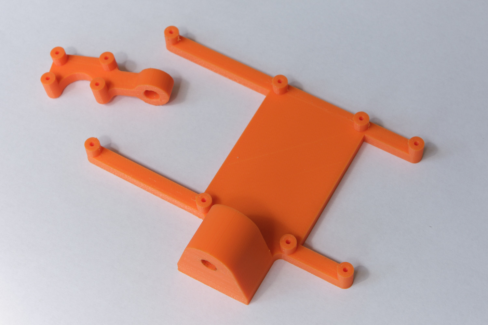
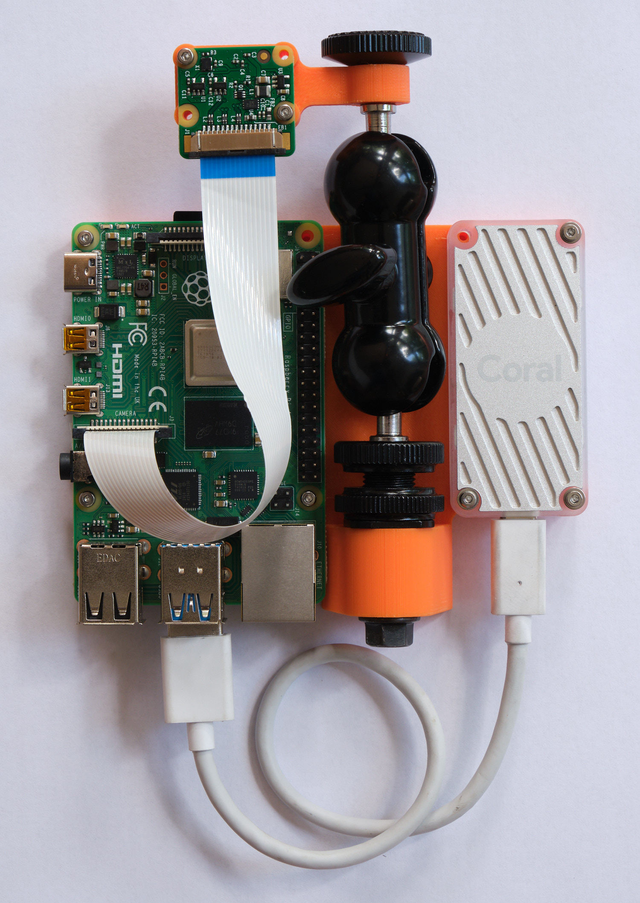
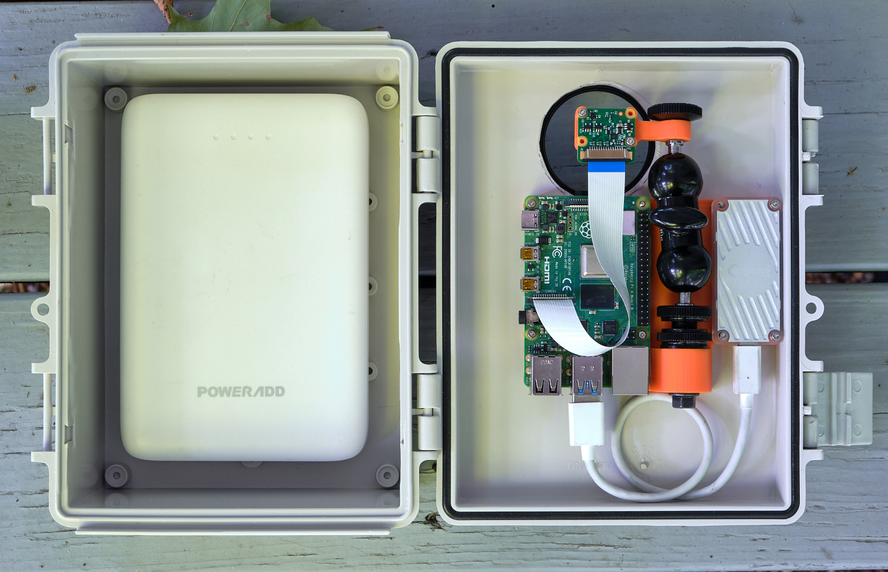
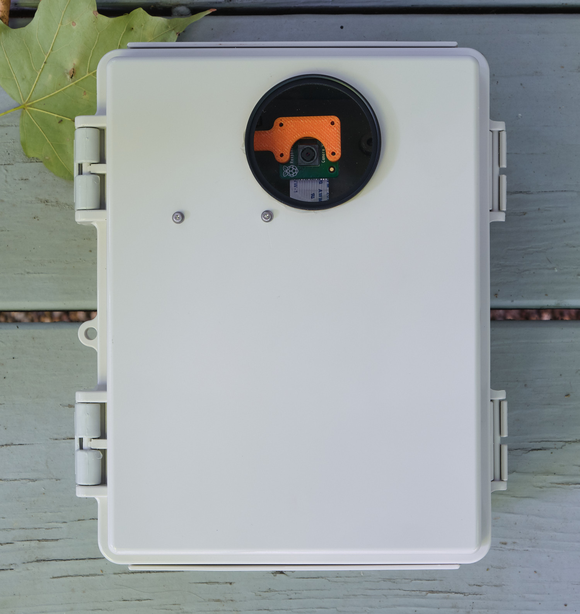

# Raspberry Pi Urban Mobility Tracker (DeepSORT + MobileNet)

The Raspberry Pi Urban Mobility Tracker is the simplest way to track and count pedestrians, cyclists, scooters, and vehicles. For more information, see the original blog post [<a target="_blank" href="https://nathanrooy.github.io/posts/2019-02-06/raspberry-pi-deep-learning-traffic-tracker/">here</a>].

<span>
  
  
</span>
<span>
  
  
</span>

## Hardware
<b>Primary Components</b>
1) Raspberry Pi (<a target="_blank" href="https://www.raspberrypi.org/products/raspberry-pi-4-model-b"/>ideally v4-b</a>)
2) Raspberry Pi camera (<a target="_blank" href="https://www.raspberrypi.org/products/camera-module-v2/">ideally v2</a>)
3) Google Coral Accelerator (<a target="_blank" href="https://coral.ai/products/accelerator">Not required, but strongly encouraged</a>)

<b>Secondary Components</b>
1) Ballhead mount: https://www.amazon.com/gp/product/B00DA38C3G
2) Clear lens: https://www.amazon.com/gp/product/B079JW114G
3) Weatherproof enclosure: https://www.amazon.com/gp/product/B005UPAN0W
4) 30000mAh battery: https://www.amazon.com/gp/product/B01M5LKV4T

<b>Notes</b>
- The mounts located in `geometry/` are currently represented as `stl` files which are 3d printer ready. I don't currently have a 3d printer so I used the crowd sourced printing service <a target="_blank" href="https://printathing.com/">https://printathing.com/<a> which yielded great results (kind of a sales pitch, but not really. I just like the service).
- The original <a target="_blank" href="https://www.freecadweb.org/">FreeCAD</a> file is also included just in case you want to modify the geometry.
- The only cutting necessary is through the plastic case to allow for the lens. This joint should then be sealed using silicone caulk to prevent any moisture from entering.
- All the secondary components listed are just suggestions which worked well for my build. Feel free to use what ever you want.

<table>
  <tr>
    <td>3D printed mounts</td>
    <td>mounts with attached hardware</td>
  </tr>
  <tr>
    <td></td>
    <td></td>
  </tr>
 </table>
 
 <table>
  <tr>
    <td>Final setup (open)</td>
    <td>Front (closed)</td>
  </tr>
  <tr>
    <td></td>
    <td></td>
  </tr>
 </table>
 
## Install
1) UMT has been dockerized in order to minimize installation friction. Start off by <a href="https://docs.docker.com/engine/install/">installing Docker</a> on your Raspbery Pi or what ever you plan on using. The instructions below assume a Raspberry Pi v4 with <a href="https://downloads.raspberrypi.org/raspios_armhf/images/raspios_armhf-2020-12-04/">Raspberry Pi OS 2020-12-02</a>. This is also a good time to add non-root users to the Docker user group. As an example, to add the Raspberry pi default user `Pi`:
```sh
sudo usermod -aG docker Pi
```

2) Open a terminal and create a directory for the UMT output:
```sh
UMT_DIR=${HOME}/umt_output && mkdir -p ${UMT_DIR}
```

3) Move into the new directory:
```sh
cd ${UMT_DIR}
```

4) Download the Dockerfile and build it:
```sh
wget https://raw.githubusercontent.com/nathanrooy/rpi-urban-mobility-tracker/master/Dockerfile

docker build . -t umt
```

5) Start the Docker container:
```sh
docker run --rm -it --privileged --mount type=bind,src=${UMT_DIR},dst=/root umt
```

6) Test install by downloading a video and running the tracker:
```sh
wget https://github.com/nathanrooy/rpi-urban-mobility-tracker/raw/master/data/videos/highway_01.mp4

umt -video highway_01.mp4
```
If everything worked correctly, you should see a directory labeled `output` filled with 10 annotated video frames.


## Model Choice
The default deep learning model is the MobileNet v1 which has been trained on the <a target="_blank" href="http://cocodataset.org">COCO dataset</a> and quantized for faster performance on edge deployments. Another good model choice is <a target="_blank" href="https://github.com/nathanrooy/ped-net">PedNet</a> which is also a quantized MobileNet v1 however, it's been optimized specifically for pedestrians, cyclsts, and vehicles. To use PedNet, simply download it from its repo here: https://github.com/nathanrooy/ped-net or clone it.
```sh
git clone https://github.com/nathanrooy/ped-net
```
Once the model and labels have been downloaded, simply use the `modelpath` and `labelmap` flags to specify a non-default model setup. As an example:
```sh
umt -camera -modelpath pednet_20200326_tflite_graph.tflite -labelmap labels.txt
```

## Usage
Since this code is configured as a cli, everything is accessible via the `umt` command on your terminal. To run while using the Raspberry Pi camera (or laptop camera) data source run the following:
``` sh
umt -camera
```
To run the tracker on an image sequence, append the `-imageseq` flag followed by a path to the images. Included in this repo are the first 300 frames from the MOT (<a target="_blank" href="https://motchallenge.net/">Multiple Object Tracking Benchmark</a>) Challenge <a target="_blank" href="https://motchallenge.net/vis/PETS09-S2L1">PETS09-S2L1</a> video. To use them, simply download/clone this repo and cd into the main directory.
```sh
umt -imageseq data/images/PETS09-S2L1/
```
To view the bounding boxes and tracking ability of the system, append the `-display` flag to view a live feed. Note that this will greatly slow down the fps and is only recommended for testing purposes.
```sh
umt -imageseq data/images/PETS09-S2L1/ -display
```
By default, only the first 10 frames will be processed. To increase or decrease this value, append the `-nframes` flag followed by an integer value.
```sh
umt -imageseq data/images/PETS09-S2L1/ -display -nframes 20
```
To persist the image frames and detections, use the `-save` flag. Saved images are then available in the `output/` directory.
```sh
umt -imageseq data/images/PETS09-S2L1/ -save -nframes 20
```
To run the tracker using a video file input, append the `-video` flag followed by a path to the video file. Included in this repo are two video clips of vehicle traffic.
```sh
umt -video data/videos/highway_01.mp4
```
In certain instances, you may want to override the default object detection threshold (default=0.5). To accompish this, append the `-threshold` flag followed by a float value in the range of [0,1]. A value closer to one will yield fewer detections with higher certainty while a value closer to zero will result in more detections with lower certainty. It's usually better to error on the side of lower certainty since these objects can always be filtered out during post processing.
```sh
umt -video data/videos/highway_01.mp4 -display -nframes 100 -threshold 0.4
```
To get the highest fps possible, append the `-tpu` flag to use the Coral USB Accelerator for inferencing.
```sh
umt -imageseq data/images/PETS09-S2L1/ -tpu
```

## References
```
@inproceedings{Wojke2017simple,
  title={Simple Online and Realtime Tracking with a Deep Association Metric},
  author={Wojke, Nicolai and Bewley, Alex and Paulus, Dietrich},
  booktitle={2017 IEEE International Conference on Image Processing (ICIP)},
  year={2017},
  pages={3645--3649},
  organization={IEEE},
  doi={10.1109/ICIP.2017.8296962}
}

@inproceedings{Wojke2018deep,
  title={Deep Cosine Metric Learning for Person Re-identification},
  author={Wojke, Nicolai and Bewley, Alex},
  booktitle={2018 IEEE Winter Conference on Applications of Computer Vision (WACV)},
  year={2018},
  pages={748--756},
  organization={IEEE},
  doi={10.1109/WACV.2018.00087}
}
```
Additionally, the following repo was referenced during the DeepSORT implementation:
```
https://github.com/theAIGuysCode/yolov4-deepsort
```
